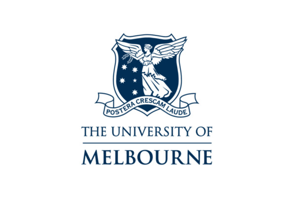

# Welcome.

&nbsp;
&nbsp;

### This website is intended for internal stakeholders of the **Future Health Today** initiative. It presents modern data analysis workflows using *R*, and demonstrates how to use functions from *fht* — an R package developed in support of Future Health Today. 

&nbsp;
&nbsp;

### Interested parties and collaborators can download the *fht* package from [Github](https://github.com/PsychlytxTD) or learn more about [Future Health Today here.](https://medicine.unimelb.edu.au/school-structure/general-practice/engagement/primary-care-community/research/future-health-today).

&nbsp;
&nbsp;

### Please note that all datasets used on this website are fictional and unrelated to any active projects. 

&nbsp;
&nbsp;
&nbsp;
&nbsp;
